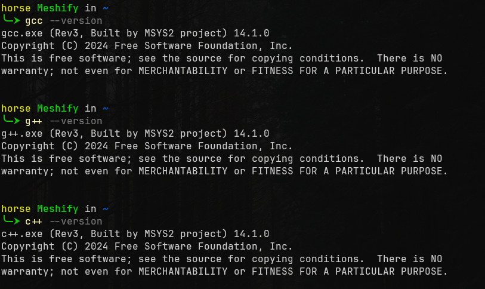
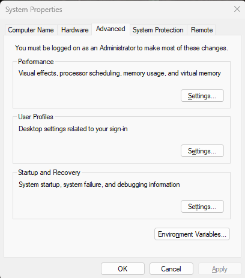
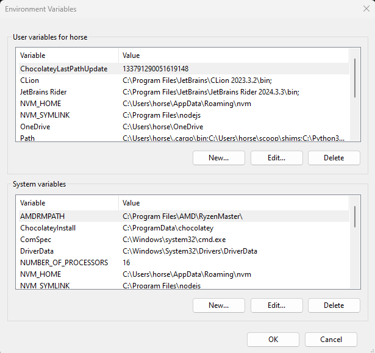
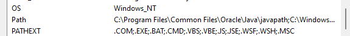
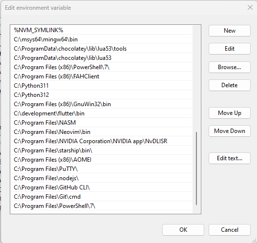

> DISCLAIMER: The University of Lethbridge is not responsible for the set-up of your machine, this is a guide set up by the ULSCU.
{: .prompt-warning }

> WARNING: Changing critical settings within the programs we are working on can damage your system. If you are unsure, start by making a backup so if something does go terribly wrong, you don't lose your data.
{: .prompt-warning}

## Install MSYS2 Executable

In order to install the CPP compiler on your Windows machine, you will need to
install the **MSYS2 executable**. It can be found [here](http://www.msys2.org).

Once downloaded, run the executable and use the default location of `C:\msys64`
and finish the install. A new terminal window should open with the follow format
in the first line of the terminal `user@desktop UCRT64`. If this window does not
open, go to your start menu, then your program list. Your system might have a
folder labeled **MSYS2** or it might have a list of programs starting with **MSYS2**
followed by different endings like `CLANGXX` or `MINGWXX` where `XX` is `32` or
`64`. Open the **MSYS2 UCRT64 terminal** and update the terminal using `pacman -Syu`.

### Using Pacman

> Pacman is not used in any Windows package manager but **MSYS2** is maintained in Linux and uses one of the Linux package managers for distribution. This would be the only place where it is used.
{: .prompt-info}

To install the gcc compiler run `$ pacman -S mingw-w64-ucrt-x86_64-gcc` pressing
enter to keep installing when prompted. This command will save the compiler to
the *C:\msys64\usr\bin* path. Keep this in mind for later.

### Check Install

Now to check if it is installed. Open up your terminal of choice
(I recommend Powershell 7) and try the following commands one at a time pressing
enter after each one: `gcc --version`, `g++ --version`, and `c++ --version`.

#### Check if on Path



The output from each one should be the name of the program followed by the
version and copyright information. If an error is showing or nothing at all,
then it needs to be added to the PATH.

Adding programs to the PATH is fairly easy. All you need to know is the location
of the information you need. It is usually located inside of the *\bin* folder
where the program was saved. Open the start menu and type in
`Edit the system environment variables` and press enter.

#### Edit Variables


A smaller window should open titled **System Properties** with the **Advanced** tab
already open. Towards the bottom of the window there is a button called
**Environment Variables**. Click it opening another window.

#### System Properties



There will be two options to pick from. We want to use the bottom section called
**System Variables**.

#### User or System Variables



Be careful in here since it can change how your system works or stop it from working!

You will need to scroll down to where you see *Path* and click it once to
highlight it and click *edit*.

#### System Path



There should be a list of programs in this new window.

There should be a list of buttons on the right side. Click *New* and paste
`C:\msys64\usr\bin` and click *OK*. Order does not matter here. We just want to
make sure the system knows where to look for the program.

#### Edit System Variables



Close your current terminal session and open a new terminal to rerun the
commands from earlier (`gcc --version`, `g++ --version`, and `c++ --version`).
If they are still not working then you might also need to add
`C:\msys64\mingw64\bin` to the PATH as well. This should fix any issues you
might have. Close all of the `Edit system environment` windows by clicking `OK`.
Now go run a simple C++ program to check if compiler is working!

```c++
#include <iostream>

int main() {
    std::cout << "Hello World!" << std::endl;
    return 0;
}
```
