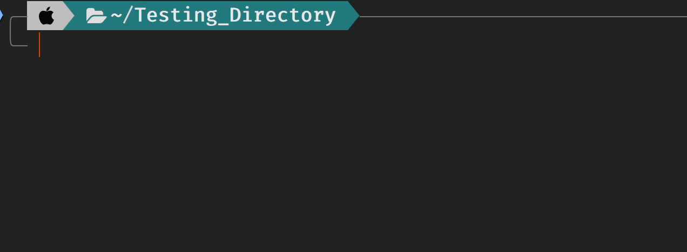
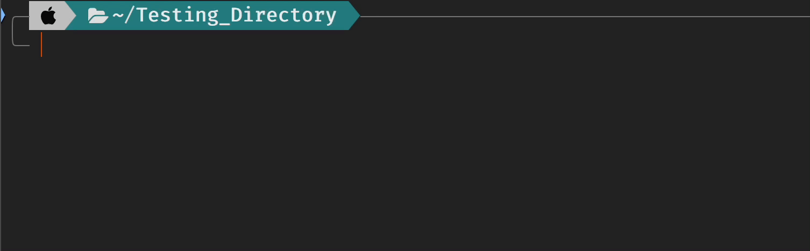
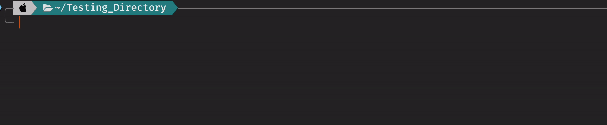
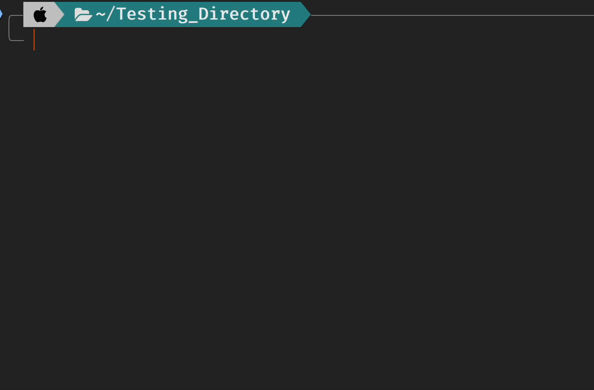
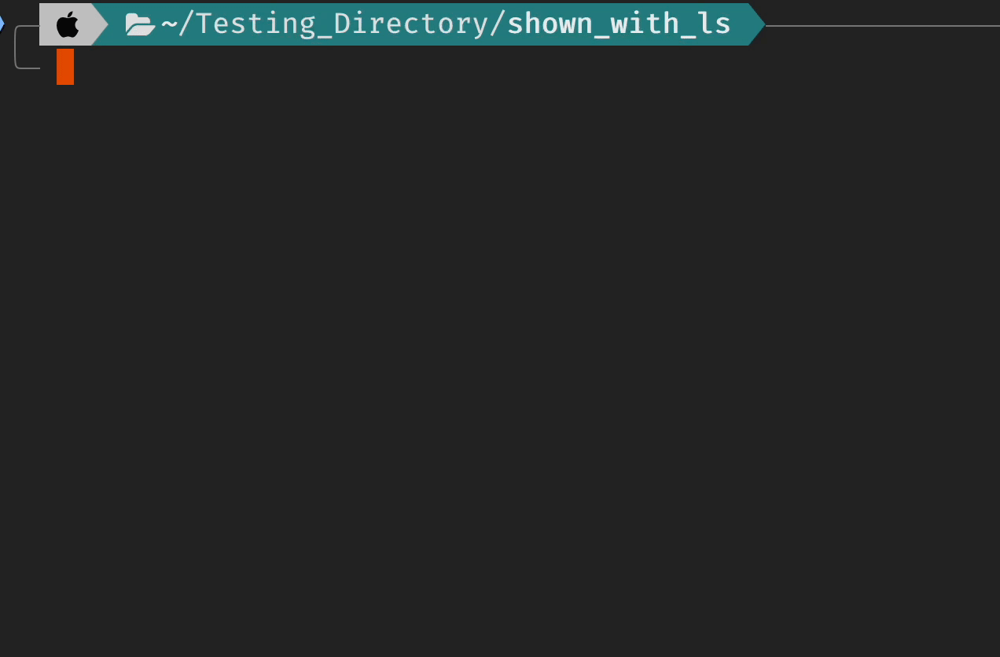
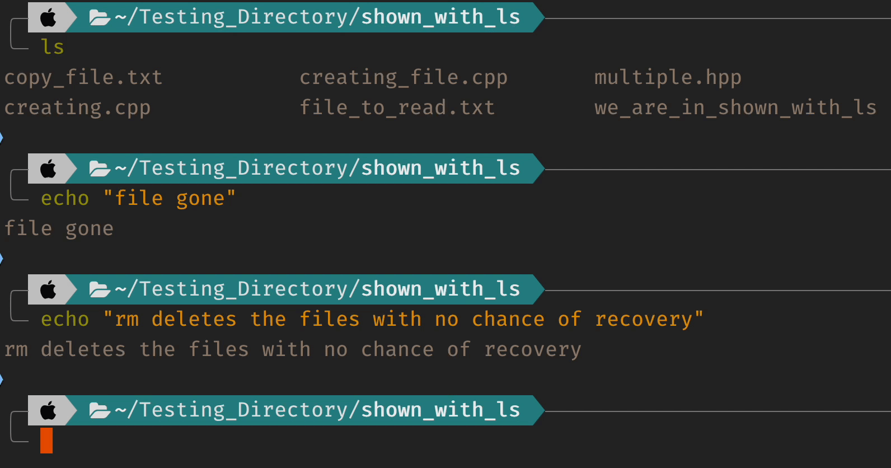
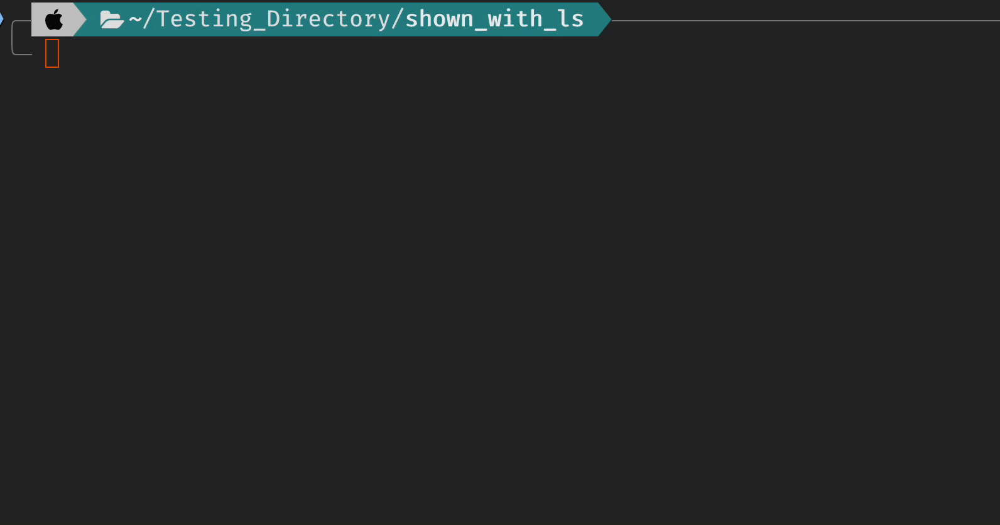
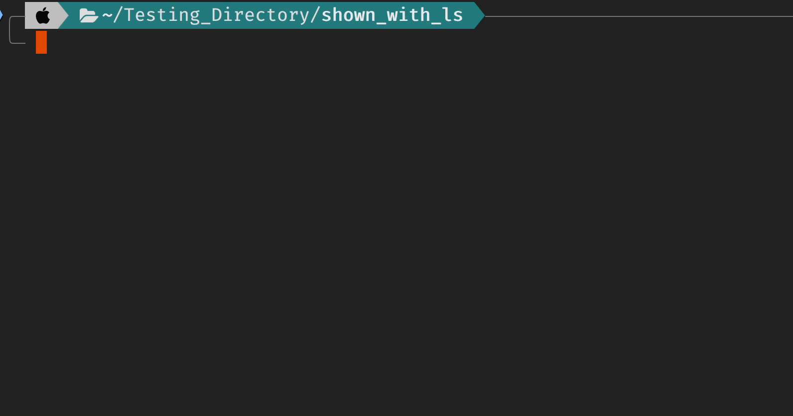

The terminal is a tool that you will need to get comfortable using one
way or another, here is a quick guide on various commands you can use.

## pwd

`pwd` stands for **print working directory** and when entered into the command line
will tell you your path from home. For example, when in the desktop folder, I can
run `pwd` and get the output:

`/Users/user/Desktop`

## ls

`ls` stands for list, and lists the files and directories in a directory.

you can add extensions to the `ls` command, the ones I use most frequently are:
`-a` or `-A`, these extensions will allow you to see hidden files/folders. These
files / folders begin with . followed by their name.

In my home directory when I run `ls -a` I get the following output:

## cd

`cd` stands for change directory, and it will change your directory to the one
you specify.

To move backwards from one directory to it's parent, you can add the following
extensions `..` or `...`. The `..` extension will move you one directory backwards
the `...` extension will move you two directories backwards. And just typing `cd`
will move you all the way back to the home directory.

## touch

> For windows users, windows does not have the `touch` command, instead, you can use: `echo. > filename.filetype`. Or if you use powershell, you can use the `New-Item` command.
{: .prompt-info }

The touch command is responsible for creating files, by typing `touch filename.filetype`
the file is created in the directory you are currently in.

Touch can also be used to create multiple files at once:

`touch main.cpp matrix.cpp matrix.hpp`

Will create the files `main.cpp`, `matrix.cpp` and `matrix.hpp` in the directory
you are currently in.

Touch can be used to add files to directories you are not currently in - you will
still need to specify the path though.

## cat

The `cat` command has a couple of uses, when a file is added infront of it, the
text within the file will be read and output into the terminal. This command is
really useful for getting a quick look at the inner workings of a file.

This way of using `cat` has a couple of extensions, the ones that I use the most
are `-s`, `-b` and `-sb`. `-s` will remove excess spaces between lines making files
easier to read. `-b`  will add line numbers infront of each line. These two
extensions can be used in conjunction with the extension: `-sb`.

Another use of the `cat` command is to copy the contents from one or more files
into another file. The way to do this is best shown with an example:

## man

The `man` command which stands for manual, will bring up a manual for the specific
command typed after it.

To exit the `man` page type q.

## rm

The `rm` command which stands for remove is the command responsible for deleting
files and directories.

> [!Warning]
> When using this command files / directories will not be moved to trash when they
> are deleted, they will be permenantly removed from existence, there is not way
> to recover files when using rm. Make sure you are deleting what you want to be
> deleleting.
>

You can also delete multiple files at once:

`rm f1.ft f2.ft`

To delete folders, you need to add an extension `-r`:

`-r` means recursive will remove all files and directories within the directory that
is to be deleted.

In use:

`rm -r dir_name`

## clear

`clear` is used to clear the terminal screen.

## echo

`echo` is used to output to the terminal screen. Although not useful right now
when using make or another bash script it is very useful to use to tell the user what
is happening behind the scenes.

`echo "Hello World!"`

Also, not using a gif for this one since I've used it in the other gifs

## head and tail

## whoami

`whoami` is used to tell who the current user is. It has uses, just not something
you'll use often.

## cal

`cal` displays a calander, that's pretty much all it does, just added it for fun.

## Issues

If you see any issues or something wrong inside of this guide do not
hesitate to message an executive so we can fix it.
