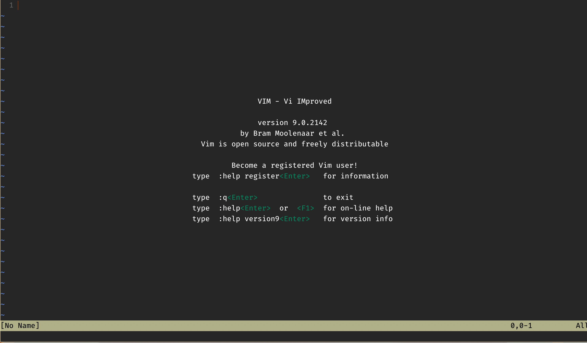
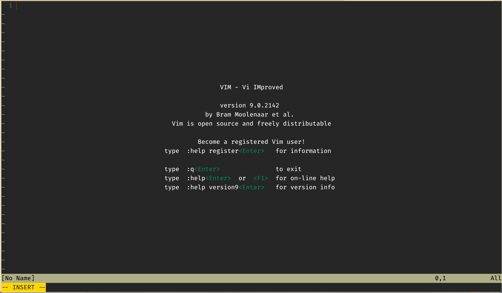
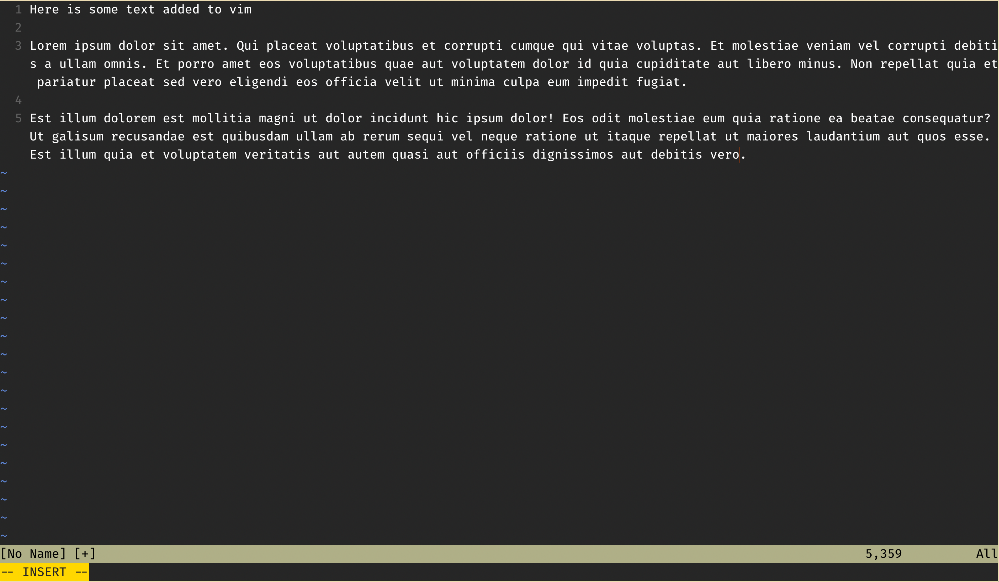

## What is Vim?

Vim, short for "Vi improved" is a powerful, and highly configurable
command line text editor. It is primarily keyboard driven, but you
can configure it to allow mouse interactions.

## Installing Vim

### Install on Windows

I won't be able to explain it that well, I use a Mac, please see the [download page](https://www.vim.org/download.php).

### Install on Mac

Vim by default is installed on most Unix based machines (OSX and Linux). Though
if for some reason your mac does not have Vim installed, you can use [brew](https://formulae.brew.sh/formula/vim)
to install it.

If that command doesn't work [Install Brew](https://brew.sh/).

## Basics Commands of Vim

### Entering Vim

**First create a testing file:**

```zsh
touch testing.txt
```

There are three ways that I know of to open vim. The first is just by typing `vim`
into your command line, the next is to type `vim .`, this will open up you're
current directory, and the final is to use `vim filename.filetype`.

For this tutorial we will use `vim testing.txt`. Upon opening your file, you should
see something similar to this in your terminal: 

## Adding Text

If you start typing, you will find that you cannot write anything. This is
because vim is a modal editor. Vim has five modes in total, however, as a beginner
you really only need to know two, they are:

- **Normal Mode** (For moving around the file)
- **Insert Mode** (For writing text)

You can learn the other three another day.

Currently you should be in normal mode, however, your file is empty. To begin writing
text, hit `i`, this will set your current mode to insert. See the difference here:


And now we can add text:



## Exiting Vim

Now that you have written to your file, you may be wondering how to exit **Insert
Mode**, and exit Vim in general. You can exit insert mode by hitting escape `esc`
on your keyboard, This will put you back into **Normal Mode**.

Once in **Normal mode**:

- To save your file but not exit type `:w`. This executes the `write` command,
which saves what you have written so far.
- To save and exit, type `:wq`. This executes the `write` and `quit` commands,
which will save your file, and exit Vim.
- And finally to force quit without saving type `:q!`.

## Navigation

If you exited your file, re-enter it, because now I'll cover navigation! There
are a couple of ways to navigate around your file in Vim.

- You can use your mouse if it's enabled in your Vim settings.
- You can use the arrow keys.
- Or you can use the `h`, `j`, `k`, and `l` keys.

Using the `h`, `j`, `k` and `l` keys for navigation may seem a little unhinged,
but trust me, it makes sense. For a lot of the naviation you need to use as a
programmer, you can get by with using the `hjkl`. Unlike the arrow keys and the mouse
the `hjkl` keys are very easibly accessed on the home row of your keyboard. Which
makes using them to navigate really convenient. Also, their use is pretty easy
to get the hang of.

While in **Normal Mode**:

- `h` moves your curser left
- `j` moves your curser down
- `k` moves your curser up
- `l` moves your curser right

To get used to them, I'd suggest practicing for 15 minutes a day. It'll feel pretty
weird the first few days. But in a couple weeks it should feel just like riding a
bicycle.

## Vim Tutor

Congradulations! You now know the very basics of Vim, if you want to learn
more on using this beautiful editor, I suggest looking into `vimtutor`.

## The vimrc

At the top I mentioned that Vim was very configurable, however, with base Vim,
there is no clear way to configure it. This is where the vimrc file comes into play.

The vimrc file is where you can configure the Vim text editor; you can enable things
like Syntax Highlighting, Line Numbers, Rulers, and Auto Tab.

### Accessing the vimrc

To check if you have a vimrc already on your computer, go to your home directory
and type `ls -A` (on Windows this might be `dir /a`). This command will show you
all of the files and folders in a directory that are both visible, and hidden
(hidden files have a leading dot, ex: .vimrc) (it'll look like _vimrc on windows).
If you have a vimrc thats Awesome! If you don't it's pretty easy to create one.
On OSX and Linux, type `touch .vimrc` in your home directory. On Windows, type
`echo. > _vimrc` in your home directory.

## Configuring the vimrc

To configure the vimrc, first open the file using vim with `vim .vimrc`. Unless your
system has a default configuration, it should be empty.

Here's code for a basic vimrc, where I explain each command:

```vim
" This command enables text highlighting, so your C++, Python, Java, ... etc is not
" just one colour
syntax on

" This command selects a colour scheme for your editor, I use slate, there are others.
" You can also download colorschemes from the net, but that is too advanced for this
" tutorial.
colourscheme slate

" This command lets you enable line numbers
set number

" This command enables line wrapping
set wrap

" For those who love the style checker, this command sets the line wrap limit to
" 79 characters
set textwidth=79

" This command sets the width of a tab to two spaces.
set tabstop=2

" This command converst tabs to the amount of spaces defined in the tabstop.
set expandtab

" This command automatically does the indentation for you.
set smartindent
```

## Other editors

There are other editors that you can use, the purpose of this tutorial is to
give people an option for a text editor everyone has access to.

If you want to use an IDE, I recommend VS Code, Clion or Zed. If you wish to
keep using Vim, I suggest using NVim.

## Issues / Feedback / Contributing

If you see any problems with these pages (incorrect information, misspelled
words, incorrect formatting), please create an issue on the repo, or let one
of the executives know.

If you have an idea for a resource or page that could be useful, or you want
to get involved with the club, please become a contributor! See more on that
in the README.
